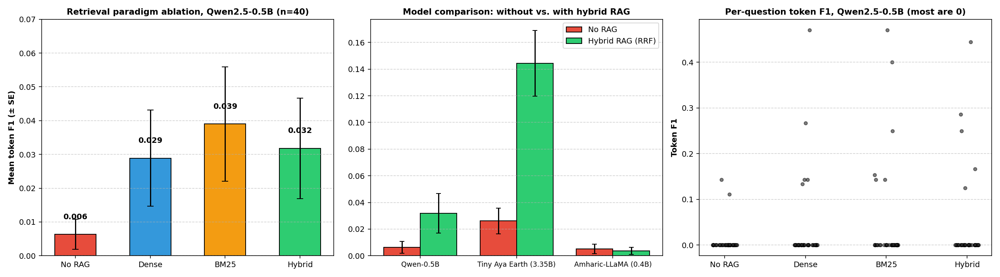

# Amharic-LLM-RAG-Benchmark

**Empirical evaluation of retrieval paradigms and model specialization for low-resource Amharic question answering.**

A small, fully reproducible study of whether retrieval-augmented generation (RAG) helps compact LLMs answer Amharic questions, comparing three retrieval paradigms (dense, BM25, hybrid RRF) and three kinds of generator (generalist, African-language specialist, Amharic-native). Data: [`dagim/amharic-qa`](https://huggingface.co/datasets/dagim/amharic-qa) (2,617 QA pairs from Amharic Wikipedia; 374 unique passages used as the knowledge base).

> **Scope note.** This is a pilot-scale study (40 generation questions, 60 retrieval questions, single seed). Treat the numbers as indicative, not conclusive. See [Limitations](#limitations).



## Setup

| Component | Choice |
|---|---|
| Dense retriever | `paraphrase-multilingual-MiniLM-L12-v2` + FAISS `IndexFlatIP` |
| Sparse retriever | BM25Okapi over Ethiopic-aware tokens |
| Hybrid | Reciprocal Rank Fusion (k=60) of dense + BM25 (equal weights) |
| Generators | `Qwen/Qwen2.5-0.5B-Instruct`, `CohereLabs/tiny-aya-earth` (3.35B, 4-bit), `rasyosef/Llama-3.2-400M-Amharic` |
| Decoding | Greedy, `max_new_tokens=60`, top-3 passages in the prompt |
| Metrics | Token F1, Exact Match, ROUGE, SacreBLEU; Recall@k / MRR for retrieval |

## Results

### 1. Retrieval quality (60 questions)

| Paradigm | Recall@1 | Recall@3 | Recall@5 | MRR |
|---|---|---|---|---|
| Dense (FAISS cosine) | 0.117 | 0.117 | 0.133 | 0.120 |
| **Sparse (BM25)** | **0.783** | **0.900** | **0.900** | **0.836** |
| Hybrid (RRF) | 0.133 | 0.583 | 0.817 | 0.373 |

BM25 is by far the strongest retriever here. The dense encoder is weak on Amharic (a plausible cause is limited Amharic coverage in the encoder's training data, which this study did not test), and equal-weight RRF lets that weak signal drag the fused ranking below BM25 alone.

### 2. End-to-end generation (40 questions, mean token F1)

| Model | No RAG | Dense | BM25 | Hybrid | Δ (Hybrid − No RAG), paired p |
|---|---|---|---|---|---|
| Qwen2.5-0.5B | 0.006 | 0.029 | 0.039 | 0.032 | +0.025, p = 0.10 (n.s.) |
| **Tiny Aya Earth 3.35B** | 0.026 | – | – | **0.144** | **+0.118, p < 0.001** (Wilcoxon p = 3.5e-5; 22 wins / 1 loss) |
| Amharic-LLaMA 0.4B | 0.005 | – | – | 0.004 | −0.001, p = 0.74 (n.s.) |

Exact Match is 0.0 in every condition.

**What the data supports**

- RAG gives a large, statistically clear gain for the specialist multilingual model (Tiny Aya Earth): token F1 roughly 5.5x, nonzero F1 on 23/40 questions vs 7/40.
- For the 0.5B generalist, all three retrieval modes improve the mean but with only 2 nonzero answers at baseline and 5-6 with RAG, the paired tests are borderline and not corrected for multiple comparisons. BM25 vs hybrid vs dense are not distinguishable at this sample size.
- The Amharic-native 0.4B model does not benefit from RAG; its outputs are long and drift (mean 37 tokens vs ~2.6 for gold answers), so it appears unable to use the context in this prompt format.
- Retrieval quality (BM25 ≫ hybrid ≫ dense) is the clearest finding. Its downstream effect on generation is suggestive, not established.

**Note on p-values.** `results/amharic_rag_enhanced_metrics_summary.csv` reports every p-value against the *Qwen No-RAG* baseline, so the Tiny Aya p-value there compares across models. The within-model p-values above were recomputed from `results/per_sample_token_f1.csv` (paired t-test, Wilcoxon agrees).

## Limitations

- **Small n.** 40 generation questions; most per-question F1 values are 0 (see right panel), so means are driven by a handful of items.
- **Metric fit.** Gold answers are very short (~2.6 tokens), and token F1 penalizes Ethiopic numerals vs. Arabic numerals (e.g. ፲፱፻፳፬ vs 1924) and morphological variants. EM = 0 everywhere. Human or LLM-judge evaluation would be more informative.
- **Retrieval-eval matching** counts a hit if the gold passage is contained in a candidate or the first 40 characters match, which is lenient.
- **Generation quirks.** Several outputs contain degenerate repetition or trailing garbage (e.g. Tiny Aya echoing the question then repeating characters); no post-processing or answer extraction is applied. One model hit the 1024-token context warning with 3 passages.
- **Different samples** for retrieval (60) and generation (40) evaluation, one seed (42), no repeated runs.
- Tiny Aya was run in 4-bit; Qwen and Amharic-LLaMA in fp16.
- Not tested: dense encoders with real Amharic support, weighted fusion, reranking, larger k, other prompts.

## Repository layout

```
notebooks/amharic_rag_enhanced_study.ipynb   full pipeline (Colab T4 compatible)
results/
  amharic_retrieval_paradigms_summary.csv    Recall@k / MRR
  amharic_rag_enhanced_metrics_summary.csv   generation metrics (p-values vs Qwen No-RAG)
  amharic_rag_enhanced_detailed_predictions.csv  all model outputs per question
  per_sample_token_f1.csv                    per-question token F1 for every condition
figures/amharic_rag_evaluation.png
```

## Reproduce

```bash
pip install -r requirements.txt
jupyter notebook notebooks/amharic_rag_enhanced_study.ipynb
```
A GPU (e.g. Colab T4) is recommended; Tiny Aya Earth needs `bitsandbytes` for 4-bit loading.

## Citation / data

Dataset: `dagim/amharic-qa` (AmQA, Abedissa et al., 2023), please check its license before reuse. If you use this work, cite this repository.

Author: Bedru Yimam Ahmed (Wollo University, Kombolcha Institute of Technology)

## License

Code: MIT (see `LICENSE`). Dataset and model weights keep their own licenses.
