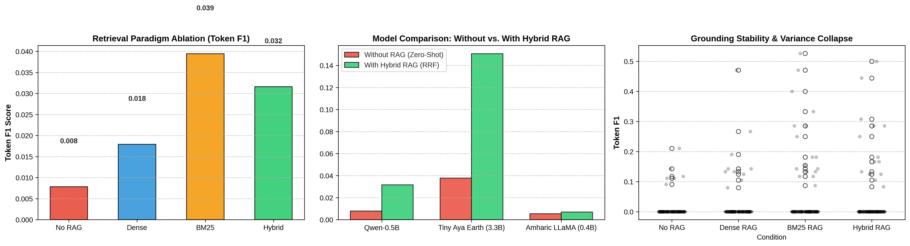

# Amharic-LLM-RAG-Benchmark

**Empirical evaluation of retrieval paradigms and model specialization for low-resource Amharic question answering.**

A small, fully reproducible study of whether retrieval-augmented generation (RAG) helps compact LLMs answer Amharic questions, comparing three retrieval paradigms (dense, BM25, hybrid RRF) and three kinds of generator (generalist, African-language specialist, Amharic-native). Data: [`dagim/amharic-qa`](https://huggingface.co/datasets/dagim/amharic-qa) (2,617 QA pairs from Amharic Wikipedia; 374 unique passages used as the knowledge base).

> **Scope note.** This is a pilot-scale study (100 generation questions, 60 retrieval questions, single seed). Treat the numbers as indicative, not conclusive. See [Limitations](#limitations).



*Left: Qwen2.5-0.5B token F1 by retrieval mode. Middle: each generator without RAG vs. with hybrid RAG. Right: per-question token F1 for Qwen under each condition; most points sit at 0 in every condition.*

## Setup

| Component | Choice |
|---|---|
| Dense retriever | `paraphrase-multilingual-MiniLM-L12-v2` (384-d) + FAISS `IndexFlatIP` |
| Sparse retriever | BM25Okapi over NFC-normalized, Ethiopic-punctuation-aware tokens |
| Hybrid | Reciprocal Rank Fusion (k=60) of the top-20 from dense and BM25 (equal weights) |
| Generators | `Qwen/Qwen2.5-0.5B-Instruct`, `CohereLabs/tiny-aya-earth` (3.35B, 4-bit NF4), `rasyosef/Llama-3.2-400M-Amharic` |
| Prompt | Amharic instruction; the RAG prompt adds the top-3 passages, the no-RAG prompt is question only |
| Decoding | Greedy (`do_sample=False`), `max_new_tokens=60`, chat template when the tokenizer has one |
| Evaluation sets | 60 questions for retrieval, 100 for generation (`random_state=42`) |
| Metrics | Token F1, Exact Match, ROUGE-1 / ROUGE-L, SacreBLEU; Recall@k / MRR for retrieval |
| Hardware | Colab Tesla T4 (15.6 GB) |

Dataset shape (all 2,617 pairs, whitespace tokens): questions average 9.2 tokens, gold answers 2.8 (median 2, max 17), passages 200 (median 185).

## Results

### 1. Retrieval quality (60 questions)

| Paradigm | Recall@1 | Recall@3 | Recall@5 | MRR |
|---|---|---|---|---|
| Dense (FAISS cosine) | 0.117 | 0.117 | 0.133 | 0.120 |
| **Sparse (BM25)** | **0.783** | **0.900** | **0.900** | **0.836** |
| Hybrid (RRF) | 0.133 | 0.583 | 0.817 | 0.373 |

BM25 is by far the strongest retriever here. The dense encoder is weak on Amharic (a plausible cause is limited Amharic coverage in the encoder's training data, which this study did not test), and equal-weight RRF lets that weak signal drag the fused ranking below BM25 alone.

### 2. End-to-end generation (100 questions, mean token F1)

| Model | No RAG | Dense | BM25 | Hybrid | Δ (Hybrid − No RAG) |
|---|---|---|---|---|---|
| Qwen2.5-0.5B | 0.008 | 0.018 | **0.039** | 0.032 | +0.024 |
| **Tiny Aya Earth 3.35B** | 0.038 | not scored | not scored | **0.151** | **+0.113** (about 4x) |
| Amharic-LLaMA 0.4B | 0.005 | not scored | not scored | 0.007 | +0.002 |

Exact Match is 0.0 in every condition.

<details>
<summary>All metrics (means over 100 questions)</summary>

| Condition | EM | Token F1 | ROUGE-1 | ROUGE-L | SacreBLEU | Token F1 p-value vs. Qwen No-RAG |
|---|---|---|---|---|---|---|
| Qwen-0.5B, No RAG | 0.0 | 0.0078 | 0.0000 | 0.0000 | 0.27 | baseline |
| Qwen-0.5B, Dense | 0.0 | 0.0179 | 0.0080 | 0.0080 | 0.45 | 9.4e-2 (n.s.) |
| Qwen-0.5B, BM25 | 0.0 | 0.0394 | 0.0493 | 0.0493 | 1.26 | 3.7e-3 (**) |
| Qwen-0.5B, Hybrid | 0.0 | 0.0316 | 0.0400 | 0.0400 | 0.80 | 1.5e-2 (*) |
| Tiny Aya Earth, No RAG | 0.0 | 0.0377 | 0.0029 | 0.0029 | 0.89 | 8.8e-5 (***) † |
| Tiny Aya Earth, Hybrid | 0.0 | 0.1506 | 0.1144 | 0.1144 | 5.12 | 9.9e-14 (***) † |
| Amharic-LLaMA, No RAG | 0.0 | 0.0054 | 0.0017 | 0.0017 | 0.08 | 4.7e-1 (n.s.) † |
| Amharic-LLaMA, Hybrid | 0.0 | 0.0069 | 0.0079 | 0.0079 | 0.14 | 8.0e-1 (n.s.) † |

† Cross-model comparison against Qwen's No-RAG scores on the same questions. It shows the model differs from Qwen's baseline, not that RAG helped that model. See the note on p-values below.

</details>

**What the data supports**

- **Retrieval quality is the clearest finding:** BM25 ≫ hybrid ≫ dense on the 60-question retrieval set.
- **Tiny Aya Earth benefits most from RAG.** Mean token F1 rises from 0.038 to 0.151 (about 4x), ROUGE-1 from 0.003 to 0.114, SacreBLEU from 0.9 to 5.1. It is also the strongest generator without retrieval (0.038 vs. 0.008 for Qwen, paired p = 8.8e-5 on the same questions). A within-model significance test for its RAG gain was not run in this notebook.
- **Qwen2.5-0.5B improves with every retrieval mode, but from a very low base.** Against its own No-RAG baseline: BM25 +0.032 (p = 0.004), hybrid +0.024 (p = 0.015), dense +0.010 (p = 0.094, n.s.). With 7 comparisons in the table, a Bonferroni threshold is 0.05 / 7 ≈ 0.007: BM25 clears it, hybrid does not. The ordering BM25 > hybrid > dense matches the retrieval ranking, which is suggestive, but the three RAG modes were not tested against each other. Even with the best retriever, mean F1 stays below 0.04.
- **The Amharic-native 0.4B model shows no measurable benefit** from RAG (+0.002 F1, n.s.). The cause was not diagnosed here; inspect `amharic_rag_enhanced_detailed_predictions.csv` for the raw outputs.

**Qualitative examples.** The notebook prints the three questions where Qwen's hybrid-RAG F1 improved most over its no-RAG answer (best cases, not a random sample). In all three Qwen copies the right span from the context ("15 ወራት", "17 ዓመታት", "450 ሚሊዮን") but pads it with stray or code-switched tokens (e.g. "Worcekta", "StreamReader"), while its no-RAG answers are degenerate repetition ("እና እና እና …"). Tiny Aya returns a fluent full sentence containing the right number, but with morphological variants of the gold answer (ዓመት vs. ዓመታት), Markdown bold, and extra clauses, all of which token F1 penalizes.

**Note on p-values.** `amharic_rag_enhanced_metrics_summary.csv` reports every p-value (paired t-test on token F1) against the *Qwen No-RAG* baseline. That is a valid RAG-effect test only for the Qwen rows. For Tiny Aya and Amharic-LLaMA it compares across models.

## Limitations

- **Small n.** 100 generation questions and 60 retrieval questions; most per-question F1 values are 0 (right panel of the figure), so means are driven by a minority of items. The paired t-test assumes roughly normal differences, which zero-inflated F1 does not satisfy; a Wilcoxon test or bootstrap CI would be more appropriate.
- **Closed-world knowledge base.** The 374 passages are the gold contexts of the dataset's own QA pairs (about 7 questions per passage), so the gold passage is always in the corpus. Real-world retrieval would be harder.
- **Metric fit.** Gold answers are very short (about 2.8 tokens), and token F1 penalizes Ethiopic numerals vs. Arabic numerals (e.g. ፲፱፻፳፬ vs 1924) and morphological variants. EM = 0 everywhere. Human or LLM-judge evaluation would be more informative.
- **ROUGE is nearly uninformative on Amharic as run.** The default `rouge_score` tokenizer lowercases and keeps only `[a-z0-9]`, so Ethiopic characters are discarded and only Latin or digit tokens (such as "15" or "450") can match. This is consistent with ROUGE-1 and ROUGE-L being identical in every row. Token F1 and SacreBLEU are the more reliable text metrics; a custom tokenizer is needed for meaningful ROUGE.
- **Retrieval-eval matching** counts a hit if the gold passage is contained in a candidate (or vice versa) or the first 40 characters match, which is lenient.
- **Generation quirks.** Several outputs contain degenerate repetition, stray tokens, or trailing garbage; no post-processing or answer extraction is applied. `max_new_tokens=60` truncates long outputs.
- **Partial scoring.** Dense and BM25 predictions were generated for Tiny Aya Earth and Amharic-LLaMA, but only their No-RAG and hybrid conditions were scored.
- **Different sample sizes** for retrieval (60) and generation (100) evaluation, one seed (42), no repeated runs.
- Tiny Aya was run in 4-bit; Qwen and Amharic-LLaMA in fp16.
- Not tested: dense encoders with real Amharic support, weighted fusion, reranking, larger k, other prompts.

## Repository layout

```
notebooks/amharic_rag_enhanced_study.ipynb   full pipeline (Colab T4 compatible)
results/
  amharic_retrieval_paradigms_summary.csv    Recall@k / MRR
  amharic_rag_enhanced_metrics_summary.csv   generation metrics (p-values vs Qwen No-RAG)
  amharic_rag_enhanced_detailed_predictions.csv  all model outputs per question
figures/amharic_rag_evaluation.png
```

## Reproduce

```bash
pip install -r requirements.txt
jupyter notebook notebooks/amharic_rag_enhanced_study.ipynb
```
A GPU (e.g. Colab T4) is recommended; Tiny Aya Earth needs `bitsandbytes` for 4-bit loading and a Hugging Face token.

## Citation / data

Dataset: [`dagim/amharic-qa`](https://huggingface.co/datasets/dagim/amharic-qa). Please check its license before reuse.

```bibtex
@inproceedings{taffa-etal-2024-low,
  title     = {Low Resource Question Answering: An {A}mharic Benchmarking Dataset},
  author    = {Taffa, Tilahun Abedissa and Usbeck, Ricardo and Assabie, Yaregal},
  booktitle = {Proceedings of the Fifth Workshop on Resources for African Indigenous Languages @ LREC-COLING 2024},
  month     = may,
  year      = {2024},
  address   = {Torino, Italia},
  publisher = {ELRA and ICCL},
  pages     = {124--132},
  url       = {https://aclanthology.org/2024.rail-1.14}
}
```

If you use this work, cite this repository.

Author: Bedru Yimam Ahmed (Wollo University, Kombolcha Institute of Technology), bedruy4@gmail.com

## License

Code: MIT (see `LICENSE`). Dataset and model weights keep their own licenses.
